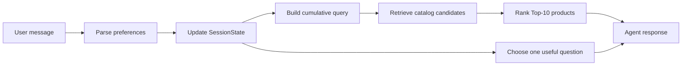

=# Shopping Copilot 项目内部 Onboarding / Kickoff Report

> 读者：4 位 engineers、1 位 PM，以及所有需要理解项目但不直接写代码的队友。  
> 目的：让全队先建立相同的“问题—数据—系统—分工”心智模型，再进入 4 天实施冲刺。  
> 配套执行文档：[技术术语、数据架构与模型笔记](technical_notes.md) 与 [4 天实施计划、四人分工与 coding agent 指南](four_day_implementation_plan.md)。
>
> 文档关系：本 report 负责说明“为什么做、整体怎么协作”；`technical_notes.md` 是术语和数据的 source of truth；`four_day_implementation_plan.md` 是文件级实现、每日 Git 节奏和 coding agent 指令的 source of truth。三者有细节差异时，以后两份执行文档为准。

---

## Executive Summary

我们要做一个 `conversational shopping Agent`：用户用自然语言表达购物需求，系统在最多 10 轮对话中，从固定的 50,000 个服装商品里找出最可能的目标商品，并返回按相关性排序的 `Top-10 parent_asin`。

这个项目的成功不等于“聊天像人”，而是同时做到三件事：

1. **找得到**：正确商品进入 `Top-10`，提升 `Hit Rate@10`。
2. **排得高**：正确商品尽量在第 1–3 名，提升 `MRR`。
3. **找得快**：少走无效对话轮次，降低 `MTTC`、提升 `Efficiency`。

最终产品是一个可在本地、无网络环境运行的 Python Agent。`OpenRouter LLM API` 与 neural models 是增强能力，不是项目能否运行的前提。

---

# 1. 这个 project 到底要我们做什么

## 1.1 从用户角度理解产品

用户不会输入精确商品 ID，而会说类似：

> “I need a black cotton shirt for hiking, but not a slim fit.”

系统需要理解其中的购物条件：

- 想买什么：`shirt`
- 颜色：`black`
- 材料：`cotton`
- 使用场景：`hiking`
- 排除条件：`not slim fit`

然后从 50,000 个商品中筛选和排序，并在同一轮给出 Top-10 推荐。如果信息还不够，系统还可以问一个具体问题，例如询问 `material` 或 `style`；用户下一轮回答后，系统将新信息累积，再重新搜索。

所以，这个产品不是单一 model，而是一条完整的决策链：



## 1.2 从比赛角度理解任务

比赛方会使用一个 deterministic `evaluator`。它在每个 session 内藏着一个目标商品；我们的 Agent 看不到这个目标。Agent 只会得到：

- 一个匿名 `user_profile`；
- 每轮一条 `user_message`；
- 当前轮数 `turn`。

每轮 Agent 必须输出：

```python
{
  "message": "自然语言回复",
  "ask_attribute": "material",
  "recommendations": [{"parent_asin": "..."}, ...],
  "usage": {"prompt_tokens": 0, "completion_tokens": 0}
}
```

其中最重要的是 `recommendations`：评分器只检查前 10 个合法、去重的 `parent_asin`。`ask_attribute` 则控制用户在下一轮愿意透露什么类别的信息；它不是自由文本，而是官方允许的有限集合。

允许值为：`category`、`material`、`color`、`size`、`style`、`brand`、`budget`、`feature`、`use_case`、`other` 或 `null`。例如返回 `"material"` 表示系统想了解材料偏好；返回 `null` 表示这一轮不再额外提问，只专注推荐。用户已经说“没有偏好”的 attribute 不可以重复询问。

## 1.3 为什么必须做 multi-turn Agent

不同用户的初始消息完整度不同。官方 session 有四类情景：

| Scenario | 占比 | 含义 | 我们需要做什么 |
|---|---:|---|---|
| `Buying` | 40% | 用户第一轮就透露重要硬条件 | 立即检索并返回推荐，不要浪费轮次 |
| `Browsing` | 40% | 用户只知道大方向 | 问一个最能缩小候选池的问题 |
| `Intent Override` | 15% | 用户在第 3 或第 4 轮改变想法 | 删除旧条件，用最新意图重建 query |
| `Boundary` | 5% | 用户对被问属性没有偏好 | 记录无偏好，不能重复问同一属性 |

`Intent Override` 是系统最容易出错的地方。例如用户先说想要 “lightweight”，之后说 “Actually, ignore my earlier preference. What I need is cotton.” 如果系统仍把 lightweight 当作核心条件，就会持续推荐错误商品。

另外，官方 evaluator 在 override 的新消息到达前不会把命中目标记作 conversion。工程上这意味着：我们不应试图依靠旧意图“提前命中”，而应在收到新消息后立即把旧 slots 从 query 中移除。

## 1.4 评分逻辑决定了产品策略

```text
TechnicalScore = 0.50 × HitRate@10 + 0.30 × MRR + 0.20 × Efficiency
```

| Metric | 非技术解释 | 产品含义 |
|---|---|---|
| `Hit Rate@10` | 目标商品有没有被推荐出来 | 搜索范围必须覆盖正确商品 |
| `MRR` | 正确商品排在第几名 | 排序要把最可能商品推到前面 |
| `MTTC` | 平均第几轮首次找到目标 | 不能一直问问题，必须尽早给推荐 |
| `Efficiency` | 把对话速度转为 0–1 分数 | 少走无效轮次就是更高分 |

官方 weak `BM25 baseline` 的 `TechnicalScore` 是 0.10671。我们所有新功能都必须通过官方 evaluator 验证是否真的超越它；“看起来更智能”但分数变低的功能不会进入最终提交。

团队文件中的优先级含义如下：`P0` 是没有它就无法提交的功能；`P1` 是超越 baseline 的核心改进；`P2` 和 `P3` 是只有在前面稳定后才尝试的增强功能。四天冲刺中，任何 `P2/P3` 都不能阻塞 `P0/P1`。

## 1.5 最终交付物是什么

最终提交不是一份模型文件，而是一个可复现产品包：

- 符合官方 `Agent` interface 的 Python implementation；
- 能运行的 `local evaluator` 结果；
- README、模型和 API 使用说明、成本/限制说明；
- 完整的 source code；
- 一段 end-to-end demo 或 walkthrough video。

必须特别注意：官方 evaluator 固定 import `starter.agent.Agent`，并以 `Agent(args.catalog)` 创建实例。我们的核心逻辑可以写在 `src/agent.py`，但 `starter/agent.py` 必须作为薄 adapter 导出该 Agent；否则 evaluator 不会执行我们的代码。

---

# 2. 我们使用哪些数据，它们长什么样

## 2.1 数据边界

我们将接触到三层数据，但只有其中两层用于比赛工作：

| 数据层 | 内容 | 能否用于 Agent inference | 正确用途 |
|---|---|---:|---|
| 原始 `Amazon Reviews 2023` | 原始 review、user ID、购买历史、timestamp、全量 metadata | 否 | 仅理解数据来源；无需下载 |
| 冻结 `catalog.jsonl` | 50,000 个服装商品 metadata | 是 | 生成本地 search index 与推荐候选 |
| `public_set.jsonl` | 200 条有公开标签的开发 session | 否 | 使用官方 evaluator 测分和做 error analysis |

不能把 `public_set.jsonl` 中的 `ground_truth` 或 `sample_id` 接入 inference code。这样做叫 `target leakage`：相当于系统在考试时读取答案，private evaluation 不会泛化，也会违反比赛精神。

## 2.2 `catalog.jsonl`：商品数据

`catalog.jsonl` 采用 `JSONL` 格式：每一行是一个独立的商品 JSON object。它是我们所有推荐的唯一商品库。catalog 只读，但可以在内存中建立 `BM25 index`、`embedding matrix` 或 derived attributes。

```json
{
  "parent_asin": "B07KCFS4VC",
  "title": "Columbia Men's Thistletown Park Crew",
  "features": ["67% Polyester, 33% Cotton", "Machine Wash"],
  "description": ["A performance crew built for outdoor activity..."],
  "price": 27.99,
  "categories": ["Clothing, Shoes & Jewelry", "Men", "Clothing", "Shirts", "T-Shirts"],
  "details": {"Department": "mens", "Manufacturer": "Columbia"},
  "average_rating": 4.7,
  "rating_number": 5531,
  "store": "Columbia"
}
```

### 每个 attribute 的含义与用法

| Attribute | 它是什么意思 | 我们怎样使用 | 使用时的陷阱 |
|---|---|---|---|
| `parent_asin` | 商品父级唯一 ID | 推荐输出、去重、exact-match 评分 | 只能输出 catalog 中真实存在的值；不能拿 variant `asin` 替代 |
| `title` | 商品标题 | 最强的精确搜索文本，如商品类型和品牌 | 少数为空，代码不能假设永远存在 |
| `features` | 商品 bullet-point 特征 | 提取 material、fit、洗护方式、性能和 use case | 是 list，必须先拼成 text |
| `description` | 商品长说明 | 增强语义搜索与 reranking | 文本可能长；不能让无关长描述盖过 title |
| `price` | 抓取时记录的美元价格 | 提供 budget 的弱排序信号 | 约 79% 缺失；null 不代表商品不符合预算 |
| `categories` | 从大类到子类的层级列表 | 最可靠的 category / department signal | 是 list；首句通常已有粗 category，不需优先重复询问 |
| `details` | 商品详情 key-value 字典 | 补充 color、size、brand、department 等 | key 不统一、部分为空，要 normalize |
| `average_rating` | 商品平均评分 | 只在其他相关性相近时轻微 tie-break | 不能压过用户明确条件 |
| `rating_number` | 商品收到评分的数量 | 只作为弱质量先验 | 高评论数不等于适合该用户 |
| `store` | 店铺或品牌字段 | 匹配用户明确品牌偏好 | 不应假设它一定是标准品牌名 |

我们已知：50,000 条商品的 `categories` 都存在；约 39,473 条 `price` 缺失；约 1,670 条没有 `details`；仅 2 条没有 `title`。这解释了为什么检索应优先依赖 `categories + title + features + description`，而不是 price。

### 数据如何变成可搜索商品

工程上会将每条商品整理为内部 `ProductDocument`：

```python
ProductDocument = {
    "parent_asin": str,
    "search_text": str,
    "category_path": list[str],
    "attributes": {
        "material": set[str], "color": set[str], "size": set[str],
        "style": set[str], "brand": set[str], "use_case": set[str]
    },
    "price": float | None,
    "quality_prior": float
}
```

其中 `search_text` 是 `title + categories + features + details + description + store` 的组合文本。`attributes` 是我们从文本和 metadata 中抽取出的条件，方便处理 “black”、“cotton” 或 “not leather” 这类用户需求。

## 2.3 `public_set.jsonl`：开发和评测数据

这份文件有 200 个公开 session。它用于本地 evaluator，不是 Agent 在线输入。

每条 record 大致包含：

```json
{
  "sample_id": "public_0001",
  "scenario_type": "buying",
  "difficulty_bucket": "easy",
  "category_bucket": "clothing",
  "user_profile": {
    "purchase_frequency": "3-4 prior purchases",
    "average_prior_rating": 5.0,
    "rating_style": "usually positive",
    "preference_tags": ["fit", "comfort", "durability"],
    "summary": "Prior purchases emphasize fit, comfort, durability..."
  },
  "ground_truth": {"parent_asin": "B09PYB7B6Z"}
}
```

| Attribute | 含义 | Agent 是否能在真实评分时看到 |
|---|---|---:|
| `sample_id` | 开发样本编号 | 否；仅供实验记录 |
| `scenario_type` | Buying / Browsing / Override / Boundary 标签 | 否；仅供按类别分析错误 |
| `difficulty_bucket` | 组织者标记的难度 | 否；不能作为 inference feature |
| `category_bucket` | 开发用的粗粒度类别标签 | 否；不能作为 inference feature |
| `user_profile` | 匿名偏好摘要 | 是；通过 `Agent.reset` 传入 |
| `ground_truth.parent_asin` | 该 session 的正确商品答案 | 否；只能被 evaluator 用来打分 |

`user_profile` 的五个 attribute：

| Attribute | 含义 | 在系统中应有的权重 |
|---|---|---|
| `purchase_frequency` | 用户过去购买次数的模糊描述 | 很低；公开集几乎无区分度 |
| `average_prior_rating` | 用户历史平均评分 | 很低；不能直接决定商品相关性 |
| `rating_style` | 用户总体偏正面、mixed 或 critical | 很低；可用于 demo 文案，不应强过滤 |
| `preference_tags` | 历史上较常出现的偏好词，如 fit、comfort | 小的 soft preference；仅在候选接近时辅助排序 |
| `summary` | 对 profile 的可读摘要 | 不建议直接塞入 query；避免把泛化文本当用户当前需求 |

## 2.4 数据完整性资源：`SHA256SUMS`

官方 kit 附带 `SHA256SUMS`。它让我们验证下载的 catalog 是否完整：

```bash
shasum -a 256 catalog.jsonl.gz
```

输出必须与 `SHA256SUMS` 中 catalog 对应 hash 一致。`SHA256` 是文件校验方法，不是 model，也不参与推荐分数。

---

# 3. 比赛方提供的资源，以及我们怎样使用 model 和 API

## 3.1 Participant Kit：除数据外最重要的官方资源

| 资源 | 它是什么 | 团队怎么用 | 为什么重要 |
|---|---|---|---|
| `starter/agent.py` | 一个很弱、stateless 的 `BM25 Agent` | 作为 E0 baseline 和官方入口；最终改为 adapter | 让我们确定正确调用方式 |
| `evaluator/local_evaluator.py` | deterministic local simulator + scorer | 每次实验后运行，比较分数 | 它比主观 demo 更可信 |
| `docs/agent_api_contract.json` | machine-readable input / output contract | D 根据它验证 response schema | 输出字段错了会直接 miss |
| `docs/evaluation_config.json` | top-k、turn、metric 配置 | 不改它；用于核对规则 | 防止团队误解评分 |
| `docs/baseline_results.json` | 官方弱 baseline 的公开分数 | 作为 E0 对照线 | 判断新模块有没有实际价值 |
| `docs/competition_specification.md` | 规则、数据边界、模型政策 | PM 和 engineers 都应读 | 防止 API、数据和提交违规 |
| `docs/submission_rules.md` | 提交、可复现和 network 要求 | Day 4 最终检查 | 最终环境可能禁网 |

正确的运行方式是从 repository root 执行：

```bash
python -m evaluator.local_evaluator
```

这条命令会创建 `results.json`，输出总体指标和四类 scenario 指标。它是所有 model 选择的唯一裁判。

### 新 technician 的 Day 1 最小启动检查

在写任何功能前，先完成这五步：

1. 解压官方 participant kit 到 repository root，保留 `data/`、`evaluator/`、`starter/` 原有目录；不要改 `evaluator/`。
2. 对下载的压缩 catalog 运行 `shasum -a 256 catalog.jsonl.gz`，与官方 `SHA256SUMS` 比较。
3. 从 root 运行 `python -m evaluator.local_evaluator`，复现 weak `BM25 baseline`，确认环境没有路径问题。
4. D 创建 `src/`，但让 `starter/agent.py` 仅 import / re-export `src.agent.Agent`；不要在两个文件维护两份 Agent 逻辑。
5. 再次运行同一 evaluator 命令，确认它已 import 新的 adapter，并且新 Agent 的 `__init__(catalog_path)` 能接受 `Agent(args.catalog)`。

完成第 5 步才算“项目已经正确启动”；之后再谈 `BM25` 调参、dense model 或 API。

## 3.2 我们使用的 model stack

比赛方没有提供 neural `benchmark model`、GPU 资源、hosted API key 或 model credits。官方提供的是 `BM25 starter agent`，所以我们自行选择公开预训练 models，并和 official baseline 比较。

| 层 | 具体资源 | 我们怎么用 | 是否必须 |
|---|---|---|---:|
| Offline core | `SQLite FTS5 BM25` | 在 50k catalog 中做关键词检索 | 是 |
| Semantic retrieval | `BAAI/bge-small-en-v1.5` | 将 query 和商品文本编码成 embeddings，找语义相近商品 | 强烈推荐，但可关闭 |
| Precision ranking | `cross-encoder/ms-marco-MiniLM-L6-v2` | 对已召回的 Top-20/50 再排序 | 可选 |
| Language fallback | OpenRouter `LLM API` | 复杂 slot extraction / override normalization | 可选 |

### 3.2.1 `SQLite FTS5 BM25`：必须保留的 Offline core

`BM25` 是关键词检索算法。用户 query 中的词如果出现在商品的 title、categories、features 等文本里，商品就会获得相关分数。它非常适合准确词，例如 `cotton`、`black`、`Nike`、`T-Shirts`。

`SQLite FTS5` 是 Python 标准库 SQLite 的全文搜索能力；它在本地内存运行，不要 API，也不需要 GPU。它是我们的 `offline fallback`：即使 dense model 或 LLM 都不可用，系统仍能做推荐。

技术注意：SQLite 的 `bm25()` raw score 是“越小越相关”。我们的代码会先转换为 `-raw_bm25_score`，让内部 `Candidate.score` 统一为“越大越好”，然后再加上 color、material、category、negative constraint 等 metadata bonus。

### 3.2.2 `BAAI/bge-small-en-v1.5`：语义检索 model

这是一款公开预训练的 English `embedding model`，约 33.4M parameters。它不会生成文字，也不会直接选商品；它把一段 English text 转换为 384 维 numeric vector。

举例：`trail running shirt` 与 `outdoor moisture-wicking tee` 用词不同，但语义类似。`BM25` 可能只因词不同而漏掉它们；`embedding` 的 vector similarity 可以把它们找出来。

**在哪里获取：** Hugging Face 的 [BAAI/bge-small-en-v1.5 model card](https://huggingface.co/BAAI/bge-small-en-v1.5)。首次运行时，`sentence-transformers` 会下载 model weights 到本机 cache。

**怎样使用：**

```bash
python -m pip install sentence-transformers torch numpy
```

```python
from sentence_transformers import SentenceTransformer

model = SentenceTransformer("BAAI/bge-small-en-v1.5", device="mps")
catalog_vectors = model.encode(product_search_texts, normalize_embeddings=True)
query_vector = model.encode([current_query], normalize_embeddings=True)
scores = query_vector @ catalog_vectors.T
```

你的 `Apple M4 Pro` 支持 `MPS`，可以优先使用 `device="mps"`；如有兼容问题则使用 `device="cpu"`。50k 商品的 384 维 `float32` embedding matrix 约 77MB，24GB RAM 足够。

它在系统中的位置是：先预编码一次 catalog；之后每轮只编码 current query，取 Dense Top-50，再与 BM25 Top-50 用 `RRF` 合并。`RRF` 只合并排名，不直接混合两个模型不可比的 raw score。

### 3.2.3 `cross-encoder/ms-marco-MiniLM-L6-v2`：可选 reranker

`reranker` 是“第二次、更精细的排序”。它不扫描完整 catalog，而是只读取已经找到的 20–50 个 candidates。`cross-encoder` 会把 `(query, product_text)` 同时放入 model，输出一个相关性分数，因此它往往比 embedding 更准确，但也更慢。

**在哪里获取：** Hugging Face 的 [cross-encoder/ms-marco-MiniLM-L6-v2 model card](https://huggingface.co/cross-encoder/ms-marco-MiniLM-L6-v2)。

**怎样使用：**

```python
from sentence_transformers import CrossEncoder

reranker = CrossEncoder("cross-encoder/ms-marco-MiniLM-L6-v2", device="mps")
pairs = [(current_query, candidate.search_text) for candidate in candidates[:20]]
scores = reranker.predict(pairs)
```

它只在 E3 的 hybrid retrieval 已经稳定后再尝试。若 evaluator 显示 `MRR` 没提升、或整体 runtime 太慢，关闭它；四天内不要为了 reranker 做 `fine-tuning`。

### 3.2.4 OpenRouter `LLM API`：可选语言理解 fallback

`LLM`，即 `Large Language Model`，在这里的责任不是搜索 50k 商品，也不是生成商品 ID。它只协助理解复杂句子，例如多个否定条件、隐含偏好、或语义模糊的 `Intent Override`。

**我们怎样接入：**

```bash
export OPENROUTER_API_KEY="..."
export OPENROUTER_MODEL="provider/model-name"
```

代码向 OpenRouter 的 OpenAI-compatible chat API 发送压缩后的 `SessionState`、最新 user message 和 allowed `ask_attribute`；它只允许返回严格 JSON：

```json
{
  "normalized_query": "black cotton hiking shirt",
  "positive_slots": {"color": ["black"], "material": ["cotton"]},
  "negative_slots": {"style": ["slim fit"]},
  "intent_override": false,
  "ask_attribute": "style"
}
```

**安全和可靠性规则：**

- 没有 `OPENROUTER_API_KEY` 时，绝不联网；
- 每个 session 最多两次调用，单次 timeout 8 秒；
- API rate limit、timeout、非法 JSON、未知 attribute 都返回 `None`；系统继续用 local parser；
- LLM 不能生成或接收 `parent_asin`、ground truth、sample ID、完整 catalog 或 API secret；
- C 根据团队 account 中的可用性、费用和速度提出 `OPENROUTER_MODEL` 建议；D 只有在 evaluator 验证有效后才将其设为可开启 feature，PM 负责确认费用、credentials 和 timeline。核心评分不依赖它。

OpenRouter 的官方 [Quickstart](https://openrouter.ai/docs/quickstart) 说明其 `/api/v1/chat/completions` 为 OpenAI-compatible endpoint。

## 3.3 我们不做什么：为什么不 fine-tune

`fine-tuning` 是用特定任务数据继续训练已有 model 的参数。它在数据足够、验证集独立时可能有价值，但不适合本次 4 天项目：

- 只有 200 条 public sessions，样本太少；
- private sessions 与 public sessions 用户、目标分离；
- 很容易对 public labels `overfitting`；
- 训练、保存和复现额外模型会增加工程与提交风险；
- 更大的得分空间来自 state、retrieval、ranking 与 question policy。

因此我们的创新不在于“训练出一个新的 neural model”，而在于把可靠的 pretrained models 和比赛规则对齐的 Agent architecture 组合起来。

---

# 4. 我们的创新点是什么

## 4.1 不是单模型创新，而是 system-level innovation

我们不会宣称从零训练一个新的 foundation model。我们的创新是一个可解释、可运行、可在资源受限环境部署的 `Adaptive Hybrid Shopping Agent`：它根据对话状态动态改变检索 query、排序权重和提问策略。

## 4.2 四个核心创新点

| 创新点 | 它做什么 | 对比赛指标的影响 |
|---|---|---|
| `Stateful Constraint Memory` | 把每轮需求存为 positive / negative slots，而非只搜索最后一句 | 提升多轮 recall，防止遗漏早期条件 |
| `Intent Override Reset` | 识别用户推翻旧偏好，删除冲突 slots 并重建 query | 防止 Override session 被旧意图污染 |
| `Hybrid Retrieval + RRF` | 结合 BM25 精确匹配和 embedding 语义匹配 | 提升 Browsing 的 `Hit Rate@10`，同时保留精确条件 |
| `Information-Gain Question Policy` | 每轮只问一个最可能缩小候选池的属性；无偏好不重问 | 降低 `MTTC`，提升 `Efficiency` |

## 4.3 我们对 pretrained models 的创新性使用

| 资源 | 常见用法 | 我们的针对性用法 |
|---|---|---|
| `BM25` | 单轮 keyword search | 与 cumulative query、negative constraint、metadata bonus 结合，成为稳定 offline core |
| `bge-small-en-v1.5` | 单独做 semantic similarity | 只输出 Dense Top-50，与 BM25 的 Top-50 用 `RRF` 融合 |
| MiniLM reranker | 对大量文本排名 | 只处理小候选集，专门改善 MRR，并以 evaluator 决定是否保留 |
| OpenRouter LLM | 全程聊天或生成推荐 | 只作为复杂语言解析 fallback，不生成商品 ID，不让外部网络成为依赖 |

这套结构的价值在于：每个 component 的职责很清晰，失败时可以降级，且每一层都能用 evaluator 独立验证。它比“全程让 LLM 猜商品”更可复现、更低成本，也更适合最终可能禁网的比赛环境。

---

# 5. 团队分工：4 位 engineers 与 1 位 PM

下面的 4 个工程角色与 [four_day_implementation_plan.md](four_day_implementation_plan.md) 完全一致；PM 不增加新的技术模块，而负责让四条工程线按同一节奏交付。

| 成员 | 主要责任 | 最终输出 | 上游 / 下游关系 |
|---|---|---|---|
| Engineer A — `Data & Retrieval` | 商品加载、metadata normalization、SQLite FTS5 BM25、候选召回 | `CatalogIndex` 和合法 Top-50 candidates | 消费 B 的 slots；把 candidates 提供给 C 和 D |
| Engineer B — `Conversation State & Policy` | 解析用户条件、维护多轮 SessionState、处理 override / boundary、选择 ask_attribute | cumulative query、allowed question、稳定状态 | 向 A 提供 slots / query；让 C 的 LLM 输出经过 validation 后再合并 |
| Engineer C — `Semantic Retrieval & OpenRouter` | optional dense retrieval、RRF 输入、OpenRouter strict JSON fallback | 可关闭的 DenseRetriever 与 LLMClient | 使用 A 的商品文本、B 的 ParsedTurn；向 D 提供可选增强 |
| Engineer D — `Integration, Evaluation & Delivery` | 官方 Agent entrypoint、模块组装、feature flags、evaluator、README、demo | 可提交、可复现的 Agent 与实验结果 | 消费 A/B/C；维护 `starter/agent.py` adapter 与 main integration |
| PM | 管理每日目标、stand-up、PR / blocker 可视化、实验决策记录、非技术团队同步、demo story | 可执行的 4 天节奏和所有人共享的项目状态 | 不替代 engineers 写 module；确保接口和交付决策被记录与推进 |

## 5.1 PM 的具体工作边界

PM 应围绕既有计划推进，而不是自己设计另一条技术路线：

- 每日组织 15 分钟 stand-up：每人汇报 Yesterday、Today、Interface、Blocker；
- 维护 PR 状态和 Day 1–4 的最低交付物，提醒 team 不在 Day 3 后开启新大型 feature；
- 要求 D 在每次完整 evaluator 后更新 `docs/experiment_log.md`；
- 让团队用 score 和 scenario metrics 决策，而不是用“感觉模型更聪明”决策；
- 汇总 README、demo 和 pitch 中的业务语言：我们帮助用户更快在模糊需求下找到商品；
- 确认 API key 不进入 Git，确认最终版本无网络也能运行。

## 5.2 每位 Engineer 的一句话目标

- A：保证“正确商品有机会进入候选池”。
- B：保证“系统记得用户说过什么，并在改变意图时忘掉旧条件”。
- C：保证“系统在词不完全相同或语言复杂时有受控增强，但不会依赖它”。
- D：保证“以上能力真的被官方 evaluator 调到，并变成可提交产品”。

---

# 6. 怎样阅读两份执行文档

## 6.1 所有人先读的共同路径

1. 先通读本 report，建立项目的业务目标、数据边界与分工概览。
2. 阅读 [technical_notes.md](technical_notes.md) 的第 1–4 节，理解评分、数据、simulator 与 workflow。
3. 阅读 [four_day_implementation_plan.md](four_day_implementation_plan.md) 的第 1–2 节，理解优先级、文件 ownership 与 shared contract。
4. 再按自己的角色进入对应章节；不要直接把自己的 coding agent prompt 丢出去而不先理解上下游 interface。

## 6.2 Non-tech teammate 与 PM 的阅读指引

目标不是学会写 Python，而是能够判断团队是否走在正确方向。

优先阅读：

- `technical_notes.md`：第 1 节（为什么评分重视速度）、第 2 节（哪些数据可用）、第 3 节（用户对话由 evaluator 模拟）、第 5.1 节（为什么不 fine-tune）、第 6 节（怎样用实验作决策）。
- `four_day_implementation_plan.md`：第 1 节（workflow）、第 1.2 节（P0–P3 优先级）、第 4 节（每日结果和 Git push）、第 5 节（验收与风险）。

读完后，PM 应能回答：

1. 为什么 Day 2 必须先有可提交的 offline Agent？
2. 为什么 Day 3 的 dense model 和 LLM 是 optional，而不是阻塞项？
3. 为什么不能只看 overall score？
4. 为什么 D 必须验证 `starter/agent.py` adapter？
5. 什么情况下应关闭一个新 model feature？

## 6.3 Engineer A 的阅读顺序

1. `technical_notes.md`：第 2.2–2.4 节，理解 catalog fields 和 `ProductDocument`。
2. `technical_notes.md`：第 4.3–4.6 节，理解 `BM25`、metadata、embedding 与 `RRF`。
3. `four_day_implementation_plan.md`：第 2.2 节共享 types、A 的完整章节、Day 1–3 排期。
4. 最后复制 A 的 coding agent prompt，但先给 agent 看 `src/types.py` 与官方 starter。

在开始 coding 前，A 必须知道 SQLite `bm25()` raw score 是“越小越好”，而团队 `Candidate.score` 是“越大越好”。

## 6.4 Engineer B 的阅读顺序

1. `technical_notes.md`：第 3 节，理解 evaluator、四类 scenario、`ask_attribute` 的作用。
2. `technical_notes.md`：第 4.1、4.2、4.8 节，理解 SessionState、slots、query rewriting 和 `Information Gain`。
3. `four_day_implementation_plan.md`：第 2.2 节共享 types、B 的完整章节、Day 1–3 排期。
4. 最后复制 B 的 coding agent prompt；人工审核 negative constraint 和 override test。

在开始 coding 前，B 必须知道：用户说无偏好后不能重复问；override 后旧 slots 必须从 query 中消失；`category` 不应成为默认首问。

## 6.5 Engineer C 的阅读顺序

1. `technical_notes.md`：第 4.5–4.7 节，理解 embedding、dense retrieval、RRF、reranker。
2. `technical_notes.md`：第 5.4–5.6 节，理解具体 local models、OpenRouter boundary、为什么不 fine-tune。
3. `four_day_implementation_plan.md`：第 1.2 节优先级、共享 contract、C 的完整章节、Day 2–4 排期。
4. 最后复制 C 的 coding agent prompt；先实现无 key 时安全的 LLMClient，再开始下载 / 载入 dense model。

在开始 coding 前，C 必须知道：LLM 只能返回结构化 intent，不能返回商品 ID；所有 optional dependency 都必须能静默关闭。

## 6.6 Engineer D 的阅读顺序

1. `technical_notes.md`：第 1 节和第 3.4 节，确认官方 scoring 与 response contract。
2. `technical_notes.md`：第 8–9 节，确认提交前检查、官方入口和本地运行命令。
3. `four_day_implementation_plan.md`：第 2 节共享 design、D 的完整章节、Day 1–4 排期、最终验收。
4. 最后复制 D 的 coding agent prompt；先让 agent 写 `starter/agent.py` adapter 和 constructor compatibility，再集成任何新功能。

在开始 coding 前，D 必须知道：evaluator import `starter.agent.Agent`，并调用 `Agent(args.catalog)`；所有可选模块 failure 都必须回退到 A+B 的 offline path。

---

# Kickoff Meeting 的最终共识

在团队正式分配 coding tasks 前，所有人应共同确认以下五句话：

1. 我们的核心目标是提升 `Hit Rate@10`、`MRR` 与 `Efficiency`，不是做一个看起来最会聊天的 LLM。
2. catalog 是唯一允许推荐的商品来源；public labels 只用于评分和分析。
3. `BM25 + SessionState + policy` 是 Day 2 必须完成的 offline core。
4. dense model、reranker 和 OpenRouter 都必须通过 evaluator 才可保留，并且可被关闭。
5. A/B/C/D 按文件 ownership 工作，PM 用每日 milestone、PR 和 experiment log 防止冲突与延期。

这些共识成立后，团队就可以按 [four_day_implementation_plan.md](four_day_implementation_plan.md) 的 Day 1 开始执行。
