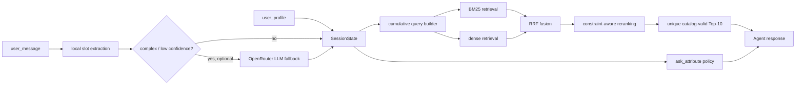

# Shopping Copilot：技术术语、数据架构与模型笔记

> 读者假设：你有 `Data Science` / `Statistics` 基础，但第一次接触 `Information Retrieval`、`LLM Agent` 和推荐系统工程。
>
> 阅读原则：本笔记用中文解释；所有重要的技术词、字段名、模型名、函数名与指标名保留 English，方便你之后阅读代码、模型文档和比赛资料。

## 目录与阅读路线

建议按下列顺序阅读，不需要先懂所有模型：

1. 先理解我们要赢什么：任务、评分和限制。
2. 再理解数据从哪里来、Agent 每一轮能看见什么。
3. 然后阅读完整 `product workflow`，知道每个组件为什么存在。
4. 最后理解每个具体 model、它从哪里下载、如何使用、是否需要 `fine-tuning`。

---

## 1. 项目目标：我们在优化什么

我们要构建一个 `conversational shopping Agent`。它的任务是：在最多 10 轮的文字对话内，从 50,000 个服装商品中找出用户真正想买的隐藏目标商品，并返回最多 10 个按相关性排序的 `parent_asin`。

这不是一个只负责“聊天”的 chatbot，也不是从零训练一个大模型。它本质上是一个受控的 `retrieval` 与 `decision` 系统：系统理解当前对话、从 catalog 检索候选商品、排序、提出一个有用的问题，并在每一轮给出推荐。

### 1.1 官方评分

```text
HitRate@10 = 成功命中目标商品的 session 数 / 总 session 数
MRR        = 每个 session 的 1 / 目标排名；未命中记为 0
MTTC       = 首次命中所在轮数；未命中记为 11
Efficiency = clip((11 - MTTC) / 10, 0, 1)

TechnicalScore = 0.50 × HitRate@10 + 0.30 × MRR + 0.20 × Efficiency
```

逐一解释：

- `Hit Rate@10`：某一轮的前 10 个推荐中是否出现正确商品。它衡量系统“有没有找回来”。
- `MRR`，即 `Mean Reciprocal Rank`：正确商品在第 1 名得 1，在第 2 名得 0.5，在第 10 名得 0.1。它衡量系统“是否真的把正确商品排在最前面”。
- `MTTC`，即 `Mean Turns to Conversion`：平均第几轮第一次命中。命中得早，用户等待和认知负担越少。
- `Efficiency`：把 `MTTC` 转成 0 到 1 的效率分。

因此，最重要的行为是：**每一轮都返回有效的 Top-10**。不要等到“信息完全收集齐”才开始推荐；那会同时损害 `Hit Rate@10`、`MRR` 和 `MTTC`。

官方 weak `BM25 baseline` 的公开分数为：`Hit Rate@10 = 0.125`、`MRR = 0.068034`、`MTTC = 9.81`、`TechnicalScore = 0.10671`。这是我们最低需要超越的基准。

### 1.2 本项目的硬限制

- 最多 10 轮；第 10 轮仍未命中即 miss。
- 只能推荐冻结 catalog 内、精确匹配的 `parent_asin`。
- catalog 是只读的：可以在内存创建 index 和派生字段，但不能改商品内容或注入虚构商品。
- 最终环境可能没有网络，因此系统必须有 `offline fallback`。
- 不能读取或利用 `ground_truth`、private sessions、原始 user ID、购买历史、review 文本等不可见信息。

---

## 2. 数据架构：哪些数据能用，哪些不能用

### 2.1 三层数据来源

| 层级 | 内容 | 我们如何使用 |
|---|---|---|
| 原始 `Amazon Reviews 2023` | review、原始 user ID、timestamp、购买历史、metadata、商品链接 | 不下载、不依赖于线上推理；官方没有把这些敏感字段传给 Agent |
| 冻结 `catalog.jsonl` | 50,000 个可检索商品 | 唯一的商品来源；只读；构建本地 index |
| `public_set.jsonl` | 200 条带标签的开发 sessions | 仅用于本地 evaluator、调参和 error analysis；推理代码不能读取 target |

原始 `Amazon Reviews 2023` 是上游学术数据集，规模非常大。比赛已经从中冻结并筛出一份可复现 catalog；我们不需要重新下载 750GB 级别的全量数据。即使上游数据里有 review 或 user history，也不能成为最终 Agent 的依赖，因为 private evaluation 不会把它们提供给我们。

### 2.2 `JSONL` 与 `SHA256 checksum`

`JSONL` 是 `JSON Lines` 的简称：一个文件中每一行是一个完整 JSON record。优点是能一行一行读取，适合 50,000 条商品的流式加载；它不是 Excel，也不是一个一次性 load 的巨大 JSON array。

`SHA256 checksum` 是文件内容的 256-bit cryptographic hash。你可以把它理解为文件的“指纹”：下载 `catalog.jsonl.gz` 后计算 hash，若与官方发布值一致，说明文件大概率没有下载损坏或被替换。它与 `BM25`、模型训练、推荐分数没有直接关系。

在 macOS 上可使用下列命令核验；输出的 hash 应与官方 `SHA256SUMS` 文件中 catalog 对应的值相同：

```bash
shasum -a 256 catalog.jsonl.gz
```

### 2.3 Catalog：一条商品 record 长什么样

`parent_asin` 是本项目最重要的字段。Amazon 中同一商品的不同颜色、尺码等 variant 可能有不同 `asin`；比赛统一以 `parent_asin` 作为商品 ID 和唯一评分对象。

```json
{
  "parent_asin": "B07KCFS4VC",
  "title": "Columbia Men's Thistletown Park Crew",
  "features": ["67% Polyester, 33% Cotton", "Machine Wash"],
  "description": ["A performance crew built for outdoor activity..."],
  "price": 27.99,
  "categories": ["Clothing, Shoes & Jewelry", "Men", "Clothing", "Shirts", "T-Shirts"],
  "details": {"Department": "mens", "Manufacturer": "Columbia"},
  "average_rating": 4.7,
  "rating_number": 5531,
  "store": "Columbia"
}
```

| 字段 | 数据类型 | 初学者解释 | 在系统中的用途 |
|---|---|---|---|
| `parent_asin` | `str` | 商品的父级唯一 ID | 推荐输出、去重、exact match；绝不能生成 catalog 外 ID |
| `title` | `str` | 商品名称 | 最有价值的精确文本信号，例如 product type 或 brand |
| `features` | `list[str]` | 商品 bullet points | 提取 material、fit、wash、功能和使用场景 |
| `description` | `list[str]` | 商品长描述 | 提供较丰富的语义信息；过长时可截断 |
| `categories` | `list[str]` | 从大类到小类的路径 | 最稳定的 category signal；例如 Men → Clothing → Shirts → T-Shirts |
| `details` | `dict[str, str]` | 不统一的 key-value metadata | 补充 color、size、brand、department 等；需要 normalize key |
| `price` | `float` 或 `null` | 商品抓取时价格 | 约 79% 为缺失值；只能是 soft signal，不能把 null 当作“不符合预算” |
| `store` | `str` | 店铺或品牌名称 | 用于 brand/store match，但不要把它当作绝对可靠 brand |
| `average_rating` | `float` | 平均评分 | 仅用于候选分数接近时的轻微 tie-break |
| `rating_number` | `int` | 评论数量 | 同样仅作为很弱的质量先验 |

本地检查结果：50,000 条中 `categories` 都存在；约 39,473 条没有 `price`；约 1,670 条没有 `details`；仅 2 条没有 `title`。所以，`categories` 和文本字段应是主信号，price 不能当主过滤器。

### 2.4 从原始 record 到内部 `ProductDocument`

我们不会写回官方 catalog，而是在启动时在内存创建一个 `ProductDocument`。它是方便检索系统使用的“整理版商品表示”。

```python
ProductDocument = {
    "parent_asin": str,
    "search_text": str,       # title + categories + features + details + description + store
    "title": str,
    "category_path": list[str],
    "attributes": {
        "material": set[str], "color": set[str], "size": set[str],
        "style": set[str], "brand": set[str], "use_case": set[str]
    },
    "price": float | None,
    "quality_prior": float
}
```

`search_text` 是把多个文本字段拼成的完整商品文本；它给 `BM25` 与 `embedding model` 使用。`attributes` 是从字段中抽取出的较结构化信息，给 filter 和 bonus 使用。`quality_prior` 只在用户条件匹配程度非常接近时才作为 tie-break，不能盖过用户明确说出的偏好。

---

## 3. Session、隐藏目标与 evaluator：对话是如何发生的

### 3.1 Agent 看得见的输入

每个 session 一开始，evaluator 调用：

```python
Agent.reset(session_id, user_profile)
```

之后每轮调用：

```python
Agent.respond(session_id, user_message, turn, top_k=10)
```

此外，官方 local evaluator 会以 catalog path 创建实例：`Agent(args.catalog)`。因此最终 `Agent` 应接受一个可选的 `catalog_path` constructor parameter：

```python
class Agent:
    def __init__(self, catalog_path: str = "data/catalog.jsonl") -> None:
        ...
```

这不是额外功能，而是让官方 evaluator 能把正确 catalog 文件交给我们的必要 interface。

Agent 能看见匿名 `user_profile` 和当前 `user_message`，但**看不见** `ground_truth`、目标商品、完整购买历史、原始评论、hidden `intent card` 和真实 scenario label。

```json
{
  "purchase_frequency": "3-4 prior purchases",
  "average_prior_rating": 5.0,
  "rating_style": "usually positive",
  "preference_tags": ["fit", "comfort", "durability"],
  "summary": "Prior purchases emphasize fit, comfort..."
}
```

`user_profile` 是粗粒度摘要，并不是可以精确识别某个用户的 profile。特别是公开集里 `purchase_frequency` 几乎没有区分度。因此它只能提供很小的 `soft preference`，例如在两个同样匹配的候选中，略偏好 comfort 相关文本；它绝不能成为 `hard filter`。

### 3.2 隐藏 `intent card` 与 simulator

本比赛的用户对话不是 Amazon 的真实聊天记录。evaluator 从隐藏目标商品的 metadata 生成 `intent card`，并用 deterministic `customer simulator` 回答问题。它可能把 material、color、feature、style 或 budget 等信息分散到不同轮次。

```text
reset(profile)
  → evaluator 发送首句 user_message
  → Agent 返回 message + ask_attribute + Top-10
  → evaluator 先检查 Top-10 是否命中目标
  → 如果未命中，simulator 根据 ask_attribute 返回一条新的 user_message
  → 最多重复到 turn 10
```

这是一个重要细节：`ask_attribute` 才是 simulator 用来决定“用户接下来透露哪种信息”的结构化字段。自然语言 `message` 仍然要写得像正常购物助手，方便 demo，但不要假设 simulator 会理解其中的自由文本问题。

允许的 `ask_attribute` 只有：

```text
category, material, color, size, style, brand,
budget, feature, use_case, other, null
```

### 3.3 四类 scenario

| Scenario | 占比 | 初学者理解 | 正确策略 |
|---|---:|---|---|
| `buying` | 40% | 用户首轮已经给出一个重要硬条件 | 立刻检索、立刻返回 Top-10，同时问下一条高价值信息 |
| `browsing` | 40% | 用户只说大概想看什么 | 用一个能大幅缩小候选池的问题逐步收敛 |
| `intent_override` | 15% | 用户第 3 或 4 轮说“其实不要前面的了” | 清掉旧 constraints，用新意图重建 query |
| `boundary` | 5% | 用户对被问属性没有偏好 | 记录 no-preference，不要重复问同一个属性 |

`Intent Override` 常见表述是 “Actually, ignore my earlier preference...” 或 “Instead...”。收到后必须更新 `SessionState`，清除与旧需求冲突的 slots 和 query；但保留 session 的 profile 与最新消息。

还有两个 evaluator-specific 细节容易被忽略：

- `Intent Override` 的新消息到达前，即使推荐列表意外包含 target，evaluator 也不会将它记为 conversion。因此不要让旧 state 持续污染新意图到第 3/4 轮之后。
- 首句通常已经给出 target 的粗略 category；simulator 对 `category` 的额外回答价值通常较低。`ask_attribute policy` 应优先尝试 material、color、style、feature 或 `use_case`，而不是机械地先问 category。

### 3.4 必须返回的 response

```python
{
  "message": "I found several lightweight options. Do you prefer cotton or synthetic fabric?",
  "ask_attribute": "material",
  "recommendations": [
    {"parent_asin": "B000..."},
    {"parent_asin": "B001..."}
  ],
  "usage": {"prompt_tokens": 0, "completion_tokens": 0}
}
```

评分器只计算前 10 个、存在于 catalog、且不重复的 `parent_asin`。`score` 字段即使提供也不会影响官方评分。使用 API 时，把服务返回的 token 数写入 `usage`；纯本地路径填 0。

---

## 4. 系统与 product workflow：数据怎样变成推荐



下面从左到右解释每一步。

### 4.1 `SessionState`

`SessionState` 是当前 session 的短期记忆。因为 `respond` 每轮只收到最新一句 message，Agent 自己必须保存之前几轮已经知道的信息。

```python
SessionState = {
    "profile_tags": list[str],
    "messages": list[str],
    "positive_slots": dict[str, list[str]],
    "negative_slots": dict[str, list[str]],
    "asked_attributes": set[str],
    "no_preference_attributes": set[str],
    "last_query": str,
    "override_seen": bool
}
```

- `slot`：对某一个属性的结构化记录。例如 `color=["black"]`、`material=["cotton"]`。
- `positive_slots`：用户想要的条件。
- `negative_slots`：用户排除的条件，例如 “not leather”。
- `asked_attributes`：已经问过的问题，防止机械重复。
- `no_preference_attributes`：用户明确说没偏好的属性，后续不能再问。

### 4.2 `slot extraction` 与 `query rewriting`

`slot extraction` 是从自然语言中找出条件的过程。例如：

```text
"I need a black cotton shirt for hiking under $40, not slim fit."
```

可以抽成：

```python
{
  "color": ["black"],
  "material": ["cotton"],
  "use_case": ["hiking"],
  "budget_max": [40],
  "negative_style": ["slim fit"]
}
```

`query rewriting` 不是让 LLM 随意改写用户意思，而是把多轮条件合成为适合检索的短 query，例如：

```text
black cotton hiking shirt under 40 dollars exclude slim fit
```

### 4.3 `BM25` 与 `SQLite FTS5`

`BM25` 是经典的 `lexical retrieval` 算法。它把 query 拆成词，并衡量某个词在商品文本中是否出现、出现得是否罕见、出现次数是否足够多，以及文本是否过长。它特别擅长 exact phrase，例如 brand、颜色、材质和商品类型。

`SQLite FTS5` 是 SQLite 自带的 `full-text search` 功能。它能在本地内存创建倒排 index，并用 `BM25` 快速搜索；不需要 API、不需要 GPU，也不需要部署 vector database。

一个实现细节：SQLite 的 `bm25(table)` 原始数值是“**越小越相关**”（常表现为较负的值），而团队自己的 `Candidate.score` 约定为“越大越好”。因此 A 在加入 metadata bonus 前必须先转换，例如 `lexical_score = -raw_bm25_score`，最后再按 `Candidate.score` 从大到小排序。否则排名方向会被写反。

### 4.4 `metadata filter`、`hard constraint` 与 `soft preference`

`metadata filter` 指利用 `categories`、`details` 等结构化字段改变候选排序，而不是只看整段文本。

- `hard constraint`：用户明确说出的、违反后显然不合适的条件，例如 “men's shoes”、`not leather`、明确 color。它# Muse Shopping Copilot：比赛版 MVP 技术方案

对应文档：Muse Shopping Copilot 比赛版 MVP PRD 1.0  
技术目标：在严格比赛约束下，以可复现的离线检索核心争取 Hit Rate@10、MRR 与 Efficiency 的联合提升，同时为真实产品保留可替换的数据与策略接口。

## 1. 设计原则

1. Offline first：BM25、状态机和属性重排不依赖网络或可选模型。
2. Every-turn recommendation：每轮返回当前 Top-10，不等待信息完全收集。
3. Constraint first：明确的正向/负向用户条件优先于评分、热门度和 profile。
4. Deterministic by default：同一 catalog、state、策略版本必须产生稳定排序。
5. Evaluation separated：评测标签与 target rank 只在离线分析层出现。
6. Progressive enhancement：dense、reranker、LLM 都可以关闭，并不能让核心路径报错。

## 2. 总体架构

    reset(session_id, user_profile)
      -> CompetitionUserContextAdapter
      -> StateManager.create

    respond(session_id, message, turn)
      -> LocalParser.parse
      -> StateManager.update / override reset
      -> QueryBuilder.build
      -> IntentRouter.select_mode
      -> LexicalRetriever.retrieve Top-200
      -> ConstraintRanker.rank Top-50
      -> Optional DenseRetriever + RRF
      -> Optional small-pool Reranker
      -> RecommendationValidator Top-10
      -> QuestionPolicy.choose_attribute
      -> TraceRecorder.record
      -> official response

## 3. 代码结构与所有权

    data/                       官方只读 catalog 与 public set
    evaluator/                  官方只读 evaluator
    starter/agent.py            薄入口：from src.agent import Agent
    src/
      __init__.py
      types.py                  共享 dataclass
      catalog.py                CatalogIndex 与 ProductDocument
      retrieval.py              FTS5/BM25 与 metadata rank
      state.py                  parse、state、override、query
      policy.py                 intent routing 与 ask_attribute
      semantic.py               可选 dense / RRF / rerank
      llm_client.py             可选严格 JSON enrichment
      providers.py              真实落地接口及比赛适配器
      trace.py                  无标签 Agent Trace
      agent.py                  官方接口、容错与组装
    analysis/
      evaluate_traces.py        仅离线使用的 metrics 与根因报告
    tests/
      test_catalog.py
      test_state_policy.py
      test_agent_e2e.py
      test_semantic_llm.py

官方 evaluator 固定导入 starter.agent.Agent。因此业务逻辑只维护在 src.agent.Agent，starter 文件只做 re-export。

## 4. 共享数据模型

    Candidate:
      parent_asin: str
      score: float                 # 统一为越大越相关
      search_text: str
      product: dict
      route_ranks: dict[str, int]

    ParsedTurn:
      positive_slots: dict[str, list[str]]
      negative_slots: dict[str, list[str]]
      normalized_query: str | None
      is_override: bool
      suggested_attribute: str | None
      confidence: float

    SessionState:
      session_id: str
      profile_tags: list[str]
      messages: list[str]
      positive_slots: dict[str, list[str]]
      negative_slots: dict[str, list[str]]
      asked_attributes: set[str]
      no_preference_attributes: set[str]
      turn: int
      last_query: str
      mode: str                    # buying or browsing
      override_seen: bool
      strategy_version: str

允许的 slot key：category、material、color、size、style、brand、budget、feature、use_case。预算独立保存 min/max 数值；其余值统一为规范化小写字符串。

## 5. 数据索引

### 5.1 Catalog normalization

每条 JSONL record 生成 ProductDocument：

    parent_asin
    title
    category_path
    search_text
    attributes
    price
    quality_prior

flatten_text 规则：

- None 转为空字符串。
- list 使用空格连接非空元素。
- dict 转为 key value 文本。
- title、features、details、categories、store、description 都保留。
- catalog 只读；所有派生内容只保存在内存。

### 5.2 SQLite FTS5

建立内存表：

    products(
      parent_asin UNINDEXED,
      title,
      categories,
      features,
      details,
      store,
      description
    )

建议 BM25 字段权重：

    title 6.0
    categories 4.5
    features 3.0
    details 2.5
    store 2.0
    description 1.0

SQLite bm25 原始分数越小越相关。代码必须转换为 lexical_score = -raw_bm25，再与其他 bonus 合并。

### 5.3 安全 query 编译

1. 仅从当前 category、positive_slots 与最新正向 message 提取字母数字 token。
2. 去 stopwords、去重、限制最多 40 个词。
3. 用安全转义的 OR expression 执行 FTS。
4. negative_slots 永远不进入 FTS expression。
5. 发生 SQLite 错误或 query 为空时，使用已清洗的最新消息 token；仍为空则使用稳定的 catalog fallback。

这样可避免包含“not slim fit”的 query 意外提升 slim/fit 商品，也可避免 FTS 语法异常导致整轮 miss。

## 6. State、解析与意图路由

### 6.1 LocalParser

优先使用 deterministic regex 与词典解析：

| 槽位 | 典型来源 |
|---|---|
| color | black、white、blue、red、pink、green、brown、gray、purple、yellow、orange |
| material | cotton、polyester、nylon、leather、wool、spandex、silk、rayon、fabric |
| budget | under、below、less than、around、美元金额 |
| negative | not、no、without、exclude、avoid 之后的可识别属性 |
| style | slim、relaxed、casual、formal、sleeve、neck 等 |
| use_case | hiking、running、gym、winter、outdoor、work 等 |

每次解析后做 normalization，确保“grey”和“gray”等同、预算统一为数字区间。

### 6.2 Override

detect_override 识别 actually、instead、rather、ignore my earlier preference 等表达。

若确认 override：

    清空旧 positive_slots 与 negative_slots
    保留 profile_tags、messages、asked/no-preference 状态
    解析并写入当前消息的新条件
    重建 last_query

本比赛不建议做随时间自动 slot decay；10 轮内随机衰减可能删除仍然有效的硬条件。仅在明确覆盖、否定或冲突时删除。

### 6.3 Boundary

识别 “I don't have a preference for X” 与 “I don't have an additional preference for X”，将 X 加入 no_preference_attributes。QuestionPolicy 此后不得选择 X。

### 6.4 IntentRouter

不读取官方 scenario label，而根据可见状态推断：

    specificity = hard_slot_count + category_precision + token_specificity

    buying:
      已有明确 material/color/brand/budget/size 等硬条件，或候选池较小

    browsing:
      只有宽泛 category/use_case，或候选池很大

buying 提高 exact-match 与 hard constraint 权重；browsing 维持更广召回，并优先询问信息增益更高的属性。

## 7. 检索、排序与融合

### 7.1 P0 检索

    positive cumulative query
      -> FTS5 Top-200
      -> metadata/constraint-aware rank
      -> deterministic Top-50
      -> valid Top-10

Top-200 而非 Top-50 的原因是：负向条件、预算和硬约束在后处理后可能淘汰大量候选，较宽的初始池可减少目标漏召回。

### 7.2 Constraint-aware score

建议起点：

    final_score =
      lexical_score
      + 3.0 * category_match
      + 2.5 * material_match
      + 2.5 * color_match
      + 2.0 * brand_match
      + 1.5 * size_or_style_match
      + 1.0 * use_case_or_feature_match
      - 5.0 * negative_conflict
      - 0.5 * known_price_over_budget
      + 0.1 * quality_prior
      + 0.1 * profile_soft_match

数值是待实验的初始配置，不是固定真值。硬条件冲突必须显著大于质量与 profile 的 bonus。缺失 price 记为 unknown，不扣分。

排序规则：

    score descending, parent_asin ascending

确保相同输入输出稳定顺序。

### 7.3 P1 Dense + RRF

DenseRetriever 在已安装 sentence-transformers 且模型可用时：

    catalog search_text -> normalized 384-d vectors
    query -> vector
    inner product -> Dense Top-50

使用 RRF 融合 lexical 与 dense 名次：

    rrf(id) = sum(1 / (60 + rank_in_route))

不能直接相加 BM25 和 dense 原始分数。无模型、内存不足或加载失败时返回空 route；P0 继续工作。

### 7.4 Reranker

只对融合后的 Top-20 或 Top-50 处理 (query, product_text) 对。保留条件：MRR 有清晰提升，且完整 evaluator 延迟可接受。否则默认关闭。

## 8. Question Value Policy

每轮只能返回一个 allowed ask_attribute。

选择逻辑：

1. 排除已问过和 no_preference 的属性。
2. 排除当前 state 已有明确值的属性。
3. 对候选 Top-50 计算每个属性的覆盖度、值分散度和与当前模式的关联。
4. 选择 expected_candidate_reduction / cognitive_cost 最大的属性。
5. 首轮不默认问 category；官方首句通常已透露粗 category。
6. 第 7 轮起默认 null；以推荐收敛为主。

应为 simulator 规则写测试：某些 metadata 约束归属 feature，而非直觉上的 color 或 style。产品文案可询问更自然的问题，但 ask_attribute 必须为官方允许值。

## 9. 可选 LLM fallback

触发条件：

- message 超过 8 个有效 token，local parser 未提取任何 slot；
- override 语义含糊；
- 明确 feature/style 组合难以用规则规范化。

传入数据仅包括压缩后的 state、最新消息和 allowed attributes。不得传入 catalog、parent_asin、sample_id、ground truth、API key 或原始历史。

严格输出 schema：

    {
      "normalized_query": "...",
      "positive_slots": {"material": ["cotton"]},
      "negative_slots": {"style": ["slim"]},
      "intent_override": false,
      "ask_attribute": "style"
    }

所有网络错误、超时、未知 attribute、非字符串 slot、非法 JSON 都返回 None。StateManager 是最终 state owner，LLM 永远不能直接覆盖 state。

## 10. 未来真实数据接口

### 10.1 providers.py

    class UserContextProvider:
        def get_context(self, user_id, session_id) -> PersonalizationContext:
            ...

    class ConversationHistoryProvider:
        def get_recent_summaries(self, user_id, limit, purpose):
            ...

    class FeedbackProvider:
        def record_feedback(self, user_id, recommendation_id, event_type, context):
            ...

    class StrategyRegistry:
        def get_strategy(self, version) -> StrategyConfig:
            ...

    class CompetitionContextProvider(UserContextProvider):
        # 只用 evaluator 传来的 aggregate profile，禁止跨会话历史
        ...

Agent 仅依赖抽象 provider，不直接连接数据库、CRM 或外部用户服务。这样比赛环境可注入 CompetitionContextProvider，真实产品再注入经过授权的实现。

## 11. Evaluation Intelligence 与实验

### 11.1 实验序列

| ID | 配置 | 决策 |
|---|---|---|
| E0 | 官方 starter BM25 | 确认环境与 baseline |
| E1 | E0 + SessionState + cumulative query | 验证多轮 state |
| E2 | E1 + metadata bonus + negative constraints + policy | 离线 MVP 候选版本 |
| E3 | E2 + dense + RRF | 仅在 Hit Rate 提升时保留 |
| E4 | E3 + reranker | 仅在 MRR/延迟收益合理时保留 |
| E5 | E4 + LLM fallback | 仅在复杂语言收益明确且不影响离线回退时保留 |

### 11.2 防止过拟合

- Agent 源码不得读取 data/public_set.jsonl。
- 分析脚本可读取 results.json，但不能被 src/ import。
- 使用固定的公开集分层开发/保留切分选择权重；最终再在全公开集报告结果。
- 每次实验记录 commit、StrategyConfig、依赖、耗时、总体和分场景分数。

### 11.3 根因报告

analysis/evaluate_traces.py 输出：

    overall metrics
    scenario metrics
    Hit@1/3/6/10 from rank distribution
    top failure patterns
    override and boundary regression checks
    recommendation latency distribution

这些报告是比赛版的 Evaluation Intelligence Layer；无需构建 UI dashboard。

## 12. 测试与发布

### 单元测试

- catalog：null 字段、重复 ID、空 query、FTS 安全性、固定排序。
- state：累积、负向条件、override、boundary、session 隔离。
- retrieval：material/color bonus、negative penalty、null price 不过滤。
- policy：只返回允许 attribute，不重复无偏好，不在后期过度追问。
- Agent：无 reset、无候选、重复或 catalog 外 ID、可选模块异常、无 API key。

### 发布前检查

1. 断网、无 key 环境下执行 python -m evaluator.local_evaluator。
2. 确认 starter 入口导入 src.agent.Agent。
3. 确认结果文件和 Trace 不包含 secret、ground truth 或 sample mapping。
4. 从干净环境安装 required dependencies 并复现实验。
5. 将 dense、reranker、LLM feature flag 逐一关闭，验证 P0 仍可运行。
应产生很大的 penalty 或 bonus。
- `soft preference`：comfort、occasion、style、profile tags、rating 等偏好。它有帮助，但不应把满足硬条件的商品排到后面。
- `unknown value`：metadata 缺失。例如 price 是 null 时，不代表商品一定超出预算；应保持候选资格。

### 4.5 `embedding`、`dense retrieval` 与 `FAISS`

`embedding` 是把一段文本变成一串浮点数 vector 的方法。训练良好的 embedding model 会让语义相近的文本在 vector space 中靠近，即使它们没有使用完全一样的字。例如 “outdoor moisture-wicking tee” 与 “shirt for trail running” 可能相近。

`dense retrieval` 会把用户 query 和每个商品的 `search_text` 分别编码成 embedding，再按 cosine similarity 或 inner product 找相近商品。它弥补 `BM25` 只擅长字面匹配的不足。

`FAISS` 是用于高效 vector search 的 library。这里 catalog 只有 50k，直接 `NumPy` matrix multiplication 或 `FAISS` 都够用。`bge-small-en-v1.5` 的 384 维 `float32` 商品 embedding 全表约 77MB，远低于你的 24GB RAM。

### 4.6 `hybrid retrieval` 与 `RRF`

`hybrid retrieval` 是把 `BM25` 和 `dense retrieval` 结合。两者各取 Top-50，再合并为一个候选池：

```text
BM25 Top-50 + Dense Top-50 → Reciprocal Rank Fusion (RRF) → candidate Top-50
```

`RRF`，即 `Reciprocal Rank Fusion`，不直接比较不同模型的原始 score，因为 `BM25 score` 和 cosine score 的尺度不同。它只看名次：

```text
RRF(item) = Σ 1 / (k + rank_in_each_retriever)
```

因此，一个在两个检索器中都排得不错的商品会获得较高分。这种方法简单、稳健、适合时间短的 hackathon。

### 4.7 `reranker`

`reranker` 是第二阶段排序器。它不会搜索完整 50k catalog，而是读取 “当前 query + 已经召回的 20–50 个商品文本”，再更细致地判断每一对是否匹配。

它通常使用 `cross-encoder`：query 和商品文本被同时输入模型，模型直接输出一个相关性分数。它通常能改善 `MRR`，但比 embedding 慢，所以只能排小候选集。

### 4.8 `ask_attribute policy` 与 `Information Gain`

`ask_attribute policy` 决定这一轮告诉 evaluator 要问哪个字段。`Information Gain` 可以直观理解为“问完这个问题后，候选池预计能缩小多少”。

例如用户只说 “I need something for hiking”，问 material、style 或 feature 通常比问 brand 更有价值。若用户已经说过 “I don't have a preference for material”，系统应该记录并不再询问 material。第 7 轮以后，应减少继续追问，转为靠现有条件积极推荐。

---

## 5. 我们将使用的具体模型：来源、用途与使用方法

### 5.1 先回答三个常见问题

**官方有没有提供 benchmark model？**

官方提供的是一个 weak `BM25 starter agent` 和 deterministic local evaluator；它不是一个可下载的 neural benchmark model。它的分数是我们的官方对照线。我们不需要另找某个“官方 neural model”才能比较。

**我们要自己找 model 吗？**

要，但不是训练一个新模型。我们将从 Hugging Face 下载公开预训练的 `embedding model` 和可选 `reranker`，将它们作为 feature extractor / ranker 直接做 `inference`。

**我们要 `fine-tuning` 吗？**

不建议。原因不是它永远无用，而是本比赛只有 200 条公开开发 session，且 private sessions 与 public sessions 用户和目标不同。用这 200 条训练会高风险 `overfitting`，并可能把 public labels 泄漏进系统。4 天内最有价值的是做好 retrieval、state、question policy 和可靠 evaluation，而不是训练参数很多的模型。

### 5.2 最终 model stack 与优先级

| 层 | 具体选择 | 是否必须 | 解决什么问题 | 从哪里获得 |
|---|---|---:|---|---|
| `lexical baseline` | `SQLite FTS5 BM25` | 是 | 精确字词、可靠离线召回 | Python 标准库；官方 starter 已给示例 |
| `dense embedding model` | `BAAI/bge-small-en-v1.5` | 强烈推荐 | 语义相近但字面不同的 query 与商品 | [Hugging Face model card](https://huggingface.co/BAAI/bge-small-en-v1.5) |
| `reranker` | `cross-encoder/ms-marco-MiniLM-L6-v2` | 可选 | 把 hybrid Top-20/50 再排得更准 | [Hugging Face model card](https://huggingface.co/cross-encoder/ms-marco-MiniLM-L6-v2) |
| `LLM fallback` | 由 `OPENROUTER_MODEL` 配置 | 可选 | 复杂 slot extraction、矛盾 override、query normalization | OpenRouter account / API；不作为检索主线 |

商品和对话主要为 English，因此选择 English retrieval models。用户和团队可以用中文讨论，但 model 的输入文本仍是 English catalog / user messages。

### 5.3 Model 1：`SQLite FTS5 BM25`

这不是 downloaded neural model，而是第一层、必须存在的本地检索器。官方 starter 已经用它做 weak baseline。我们会改进它，而不是丢弃它：

1. 将多轮对话累积成 query，而不是每轮只搜索最新一句。
2. 给 `title` 和 `categories` 更高权重，给长 `description` 较低权重。
3. 将 extracted metadata 作为 bonus / penalty，而不是只靠词频。
4. 每轮都返回 Top-10。

这层最可靠，且最终即使 network、LLM、dense model 都不可用，也能交付可评分系统。

### 5.4 Model 2：`BAAI/bge-small-en-v1.5`

`BAAI/bge-small-en-v1.5` 是一个 English `embedding model`，约 33.4M parameters。它的输入是一段文本，输出 384 维 embedding vector；它并不直接给出商品 ID，也不负责生成回答。选择 small 版本是为了在 4 天内获得足够的语义能力，同时维持低内存和低延迟。官方 model card 提供 `sentence-transformers` 用法，并以 MIT license 发布。 [官方 model card](https://huggingface.co/BAAI/bge-small-en-v1.5)

**如何取得模型：**

```bash
python -m pip install sentence-transformers torch numpy
```

首次运行：

```python
from sentence_transformers import SentenceTransformer

model = SentenceTransformer("BAAI/bge-small-en-v1.5", device="mps")
```

`SentenceTransformer(...)` 首次执行会从 Hugging Face 下载 model weights 到本机 cache。你的 `Apple M4 Pro` 支持 `Metal`，所以可以优先尝试 `device="mps"`；若 `MPS` 有兼容问题，改为 `device="cpu"`。最终提交时若网络被禁，必须确保 `BM25` path 不依赖此下载，或在规则允许的前提下预先缓存模型。

**如何使用：**

```python
catalog_vectors = model.encode(product_search_texts, normalize_embeddings=True)
query_vector = model.encode([current_query], normalize_embeddings=True)
scores = query_vector @ catalog_vectors.T
```

先在启动阶段编码一次 50k `search_text`，之后每轮只编码一个 current query。`normalize_embeddings=True` 使 inner product 等同 cosine similarity。保存的 embedding 只是 catalog 的派生 index，不是修改 catalog。

### 5.5 Model 3：`cross-encoder/ms-marco-MiniLM-L6-v2`

`cross-encoder/ms-marco-MiniLM-L6-v2` 是 English `reranker`，约 22.7M parameters。它和 embedding model 的最大区别是：embedding model 分别编码 query 与商品，因此很快；cross-encoder 同时读取一对 `(query, product_text)`，因此能更仔细判断匹配，但每对都要单独计算，速度较慢。

它只应处理已经被 `BM25 + dense retrieval` 召回的 Top-20 或 Top-50，而绝不扫描完整 50k catalog。官方 model card 说明它可作为 retrieve-and-rerank pipeline 的第二阶段。 [官方 model card](https://huggingface.co/cross-encoder/ms-marco-MiniLM-L6-v2)

```bash
python -m pip install sentence-transformers
```

```python
from sentence_transformers import CrossEncoder

reranker = CrossEncoder("cross-encoder/ms-marco-MiniLM-L6-v2", device="mps")
pairs = [(current_query, candidate.search_text) for candidate in candidates[:20]]
rerank_scores = reranker.predict(pairs)
```

实践规则：先测 local evaluator 的总 latency；如果 CPU/MPS reranking 让整次评测很慢，保留 `hybrid retrieval`，关闭 reranker。这个模型的增益必须用 public sessions 验证，不可凭主观判断保留。

### 5.6 Model 4：OpenRouter `LLM API`

`LLM`，即 `Large Language Model`，是能够根据文本指令理解、生成和结构化文本的模型。它在本项目中不是搜索引擎，也不是商品数据库。它只在 local rules 难以判断时处理语言：例如复杂否定条件、长句中的多个偏好、或含糊的 `Intent Override`。

我们通过 OpenRouter 接入，因为其 API 与 OpenAI-style chat API 兼容。key 使用环境变量，而不是写在代码里：

```bash
export OPENROUTER_API_KEY="..."
export OPENROUTER_MODEL="provider/model-name"
```

`OPENROUTER_MODEL` 不写死某个模型名；团队可在自己的 OpenRouter account 里按可用性、费用和速度选择。代码必须只依赖固定的 JSON output contract，并且缺 key、断网、rate limit、超时或模型返回非法 JSON 时立即回到 local parser。OpenRouter 的 `/api/v1/chat/completions` 为 OpenAI-compatible endpoint。 [OpenRouter Quickstart](https://openrouter.ai/docs/quickstart)

严格限制：一次只发送压缩 `SessionState`、最新 user message、allowed attributes；不发送完整 catalog、public ground truth 或任何 secret；每 session 最多 2 次调用；LLM 不能生成或接受 `parent_asin`。

---

## 6. 实验、baseline、fine-tuning 与 error analysis

### 6.1 正确的比较顺序

不是把很多模型全部堆在一起，而是每次只改变一个变量：

| Experiment ID | 系统配置 | 目的 |
|---|---|---|
| `E0` | 官方 weak `BM25 starter` | 确认 evaluator 与环境正确 |
| `E1` | `BM25` + cumulative `SessionState` | 证明多轮 query accumulation 有用 |
| `E2` | `E1` + metadata bonus / negative constraints | 改善 Buying 与 Intent Override |
| `E3` | `E2` + `bge-small-en-v1.5` + `RRF` | 改善 Browsing 语义召回 |
| `E4` | `E3` + MiniLM reranker | 测试是否改善 MRR 且 latency 可接受 |
| `E5` | `E4` + optional OpenRouter fallback | 测试复杂文本解析是否真实有增益 |

每次运行记录 overall score、四类 scenario 分数、总 latency、是否依赖 network、token usage。若一个模块让分数下降、变慢太多或破坏 offline path，就以 feature flag 关闭它。

### 6.2 `overfitting` 与 `target leakage`

`overfitting` 是模型把少量公开数据“记住”而不是学到可泛化规律。200 条 session 不足以安全地训练或 fine-tune 一个 neural model。

`target leakage` 更严重：如果代码从 `public_set.jsonl` 读取 `ground_truth` 或利用 `sample_id` 建 mapping，就等于在考试时看答案；private score 会失真，也可能违反规则。public labels 只能被 evaluator 和分析 notebook 使用，不能进入 Agent inference path。

### 6.3 建议的 error analysis 表

每次实验后保存：

| sample_id | scenario | hit | first_hit_turn | rank | query at hit | asked attributes | failure hypothesis |
|---|---|---:|---:|---:|---|---|---|

只在分析文件里使用 `sample_id` 和 target，不让它们导入 production Agent。重点观察：

- `Browsing` 是否因为 query 太泛而召回错误类别。
- `Intent Override` 是否仍残留旧 slots。
- `Boundary` 是否重复询问无偏好属性。
- 命中却 rank 很低时，是否需要 reranker 或调整 metadata bonus。

---

## 7. 术语总表：可随时回查

| 术语 | 第一次接触时可以怎样理解 |
|---|---|
| `Agent` | 接收对话、管理状态、调用检索器、决定推荐和提问的程序，不等于单个 LLM |
| `retrieval` | 从大量商品中先找出少量可能相关 candidates 的步骤 |
| `candidate pool` | retrieval 召回、尚未最终排序的商品集合 |
| `ranking` | 对 candidates 排从最可能到最不可能的步骤 |
| `lexical retrieval` | 主要根据词面是否相同搜索，如 black、cotton、Nike |
| `dense retrieval` | 主要根据 embedding 的语义相近程度搜索 |
| `embedding` | 表示文本含义的 numeric vector，不是人能直接读的标签 |
| `BM25` | 高效、可解释的关键词排序公式 |
| `index` | 为了快速搜索而建立的数据结构，不改变原始数据 |
| `metadata` | 描述商品的结构化附加信息，如 price、categories、details |
| `filter` | 去除或强烈降低不满足明确条件的候选 |
| `reranker` | 对少量已召回候选做更精细的第二次排序器 |
| `RRF` | 依据多个检索器名次合并候选的简单稳健方法 |
| `slot` | 用户需求中的一个结构化位置，如 material=cotton |
| `hard constraint` | 明确不能违反的条件 |
| `soft preference` | 有帮助但可折中的偏好 |
| `negative constraint` | 用户明确排除的条件，如 not leather |
| `SessionState` | 单次对话的短期记忆；不跨用户保存 |
| `Intent Routing` | 判断对话偏向具体购买还是开放浏览 |
| `Intent Override` | 用户撤销或替换之前意图的行为 |
| `Information Gain` | 一个问题预计能减少多少不确定性的直观量 |
| `LLM fallback` | 只有主流程无法理解时才调用的大模型备用路径 |
| `timeout` | 请求超过限定时间即放弃，防止单次失败拖垮系统 |
| `rate limit` | API 对单位时间请求数或 token 数的限制 |
| `exact match` | `parent_asin` 必须完全一致才算正确 |
| `reproducibility` | 其他人用同样代码和说明能重复得到结果 |

---

## 8. 提交前的理解检查

在开始实现前，团队每个人都应能回答：

1. 为什么每一轮都必须返回 Top-10？
2. 为什么 `parent_asin` 而不是 variant `asin` 是唯一正确输出？
3. 为什么 price 缺失不能直接过滤？
4. 为什么 `BM25` 必须保留为 offline core？
5. 为什么 `bge-small-en-v1.5` 是先做 inference、而不是 fine-tuning？
6. 为什么 OpenRouter `LLM` 不该生成商品 ID？
7. 为什么公开集的 `ground_truth` 只能用于 evaluator 和 error analysis？

若这七题都能用自己的话回答，就已经具备开始实现本项目的完整数据与模型心智模型。

## 9. 从零启动时的最小运行检查

第一次拿到 participant kit 时，先按官方目录保留 `data/`、`evaluator/` 和 `starter/`。不要把官方 evaluator 改到 `src/agent.py`；evaluator 固定 import `starter.agent.Agent`。

我们自己的实现可以放在 `src/`，但必须让 `starter/agent.py` 成为极薄的 adapter，例如导入并重新导出 `src.agent.Agent`。这样既保留官方入口，又让团队代码保持模块化。完成后从 repository root 执行：

```bash
python -m evaluator.local_evaluator
```

若这条命令能产生 `results.json` 和 metrics，才说明“代码在正确的官方入口被真正调用”。先完成这一步，再做任何 model 优化。
